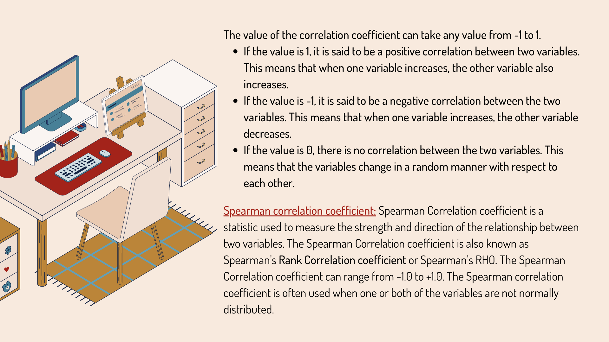
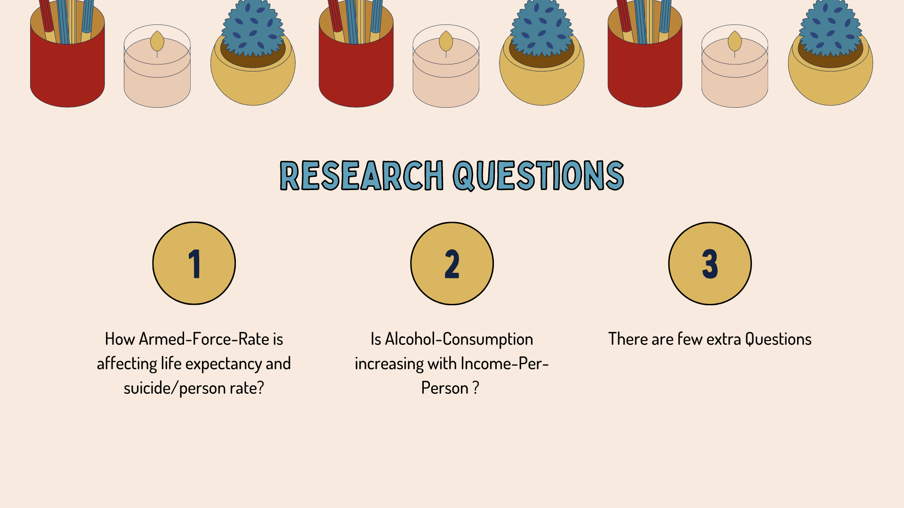

# Suicide Rate Analysis
I am trying to demonstrate the correlation between the Suicide Rate, Employment and Alcohol consumption
In general observation, it would seems that these paramenters are completely random, but on analysis I have found something very intresting.
For that you will have to refer the Code-Book.

# Required Concepts to Understand the Code-Book

# About the Dataset
Refer to the Gapminder Dataset named file. The Data that I have considered as Most important accoding to the formation of my Research Questioms are as follows:

# Thank you
